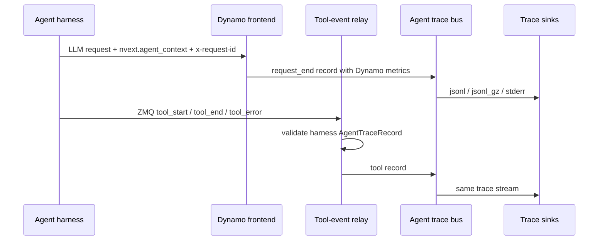

Agent workloads are easier to debug when model calls and tool calls share a
common workflow identity. Dynamo agent tracing provides that view without asking
the harness to measure serving internals itself.

The harness adds lightweight workflow metadata to each LLM request and can
publish tool lifecycle events over a local ZMQ socket. Dynamo then writes a
single trace stream that combines harness-provided structure with Dynamo-owned
request metrics such as token counts, timing, cache hit rate, queue depth, and
worker placement.

This is passive observability. Agent context does not change routing,
scheduling, or cache behavior.



## Step 1: Enable Dynamo Trace Output

For most local profiling runs, use rotating compressed JSONL:

```bash
export DYN_AGENT_TRACE_SINKS=jsonl_gz
export DYN_AGENT_TRACE_OUTPUT_PATH=/tmp/dynamo-agent-trace
```

This writes files like:

```text
/tmp/dynamo-agent-trace.000000.jsonl.gz
/tmp/dynamo-agent-trace.000001.jsonl.gz
```

To ingest harness tool events, also configure the local ZMQ endpoint that Dynamo
will bind. Harness processes connect to this endpoint as producers:

```bash
export DYN_AGENT_TRACE_TOOL_EVENTS_ZMQ_ENDPOINT=tcp://127.0.0.1:20390
```

Then start any Dynamo OpenAI-compatible backend.

<details>
<summary>Environment variable reference</summary>

| Environment Variable                       |               Required               | Default     | Description                                                                                                                                       |
| ------------------------------------------ | :----------------------------------: | ----------- | ------------------------------------------------------------------------------------------------------------------------------------------------- |
| `DYN_AGENT_TRACE_SINKS`                    |                 Yes                  | unset       | Enables local trace sinks. Supported values: `jsonl`, `jsonl_gz`, `stderr`, or a comma-separated list such as `jsonl_gz,stderr`.                  |
| `DYN_AGENT_TRACE_OUTPUT_PATH`              | If `jsonl` or `jsonl_gz` is selected | unset       | Local trace output path. For `jsonl`, this is the literal file path. For `jsonl_gz`, this is the segment prefix used to derive `.jsonl.gz` files. |
| `DYN_AGENT_TRACE_CAPACITY`                 |                  No                  | `1024`      | In-process trace bus capacity.                                                                                                                    |
| `DYN_AGENT_TRACE_JSONL_BUFFER_BYTES`       |                  No                  | `1048576`   | JSONL writer buffer size. For `jsonl_gz`, this is the max uncompressed batch size before appending a complete gzip member.                        |
| `DYN_AGENT_TRACE_JSONL_FLUSH_INTERVAL_MS`  |                  No                  | `1000`      | JSONL periodic flush interval. For `jsonl_gz`, each flush appends a complete gzip member.                                                         |
| `DYN_AGENT_TRACE_JSONL_GZ_ROLL_BYTES`      |                  No                  | `268435456` | `jsonl_gz` segment roll threshold in uncompressed bytes.                                                                                          |
| `DYN_AGENT_TRACE_JSONL_GZ_ROLL_LINES`      |                  No                  | unset       | Optional `jsonl_gz` segment roll threshold in records.                                                                                            |
| `DYN_AGENT_TRACE_TOOL_EVENTS_ZMQ_ENDPOINT` |                  No                  | unset       | Local ZMQ PULL endpoint that Dynamo binds for harness tool events. Setting this enables tool event ingestion.                                      |
| `DYN_AGENT_TRACE_TOOL_EVENTS_ZMQ_TOPIC`    |                  No                  | unset       | Optional topic filter applied to the first ZMQ message frame.                                                                                     |

</details>

`DYN_AGENT_TRACE_SINKS` is the local output enable switch. Setting
`DYN_AGENT_TRACE_OUTPUT_PATH` alone does not enable tracing. Setting only the ZMQ
endpoint enables tool ingestion but does not create local files unless a sink is
also configured.

## Step 2: Add Context to LLM Calls

Each harness LLM call should include `nvext.agent_context`:

```json
{
    "model": "my-model",
    "messages": [
        { "role": "user", "content": "Research Dynamo agent tracing." }
    ],
    "nvext": {
        "agent_context": {
            "workflow_type_id": "deep_research",
            "workflow_id": "research-run-42",
            "program_id": "research-run-42:researcher",
            "parent_program_id": "research-run-42:planner"
        }
    }
}
```

When using the OpenAI Python client, pass Dynamo's extension fields through
`extra_body` and set `x-request-id` through `extra_headers`:

```python
import uuid


def instrument_llm_request(kwargs, agent_context):
    body = dict(kwargs.get("extra_body") or {})
    nvext = dict(body.get("nvext") or {})
    nvext["agent_context"] = dict(agent_context)
    body["nvext"] = nvext

    headers = dict(kwargs.get("extra_headers") or {})
    headers.setdefault("x-request-id", str(uuid.uuid4()))

    out = dict(kwargs)
    out["extra_body"] = body
    out["extra_headers"] = headers
    return out
```

`x-request-id` is the harness's logical LLM-call ID. Dynamo copies it into
`request.x_request_id`; it is separate from Dynamo's internal request ID.

| Field               | Required | Meaning                                                                     |
| ------------------- | :------: | --------------------------------------------------------------------------- |
| `workflow_type_id`  |   Yes    | Reusable workload/profile class, such as `deep_research` or `coding_agent`. |
| `workflow_id`       |   Yes    | Top-level run identifier.                                                   |
| `program_id`        |   Yes    | One schedulable reasoning/tool trajectory.                                  |
| `parent_program_id` |    No    | Parent program for subagents.                                               |

## Step 3: Send Tool Events to Dynamo

Harnesses connect a long-lived local ZMQ PUSH socket and publish tool lifecycle
records to the endpoint Dynamo binds. Dynamo accepts `tool_start`, `tool_end`,
and `tool_error` records from the harness and writes them to the same trace
stream as LLM request records.

The ZMQ wire format is:

```text
[topic, seq_be_u64, msgpack(AgentTraceRecord)]
```

Use a bounded queue, a background publisher thread, monotonically increasing
sequence numbers, and a PUSH socket with a high-water mark. Terminal tool
records should be self-contained with `started_at_unix_ms`, `ended_at_unix_ms`,
and `duration_ms` because queue pressure, process exits, or network failures can
still drop earlier `tool_start` records. Keep `tool_start` for live/in-flight
status, but do not require it to reconstruct completed spans.

### Endpoint Ownership

Dynamo owns the shared ZMQ bind. Harnesses are producers and only connect.

This direction matters for production process trees. Agent frameworks often run
tools, subagents, plugins, or model wrappers in child processes. If every process
that loads a tracing integration tries to bind the same local endpoint, only one
process succeeds and the others fail during startup. With Dynamo as the single
collector bind and all harness processes connecting as PUSH producers, parent and
child processes can emit their own tool records independently while preserving
their own `agent_context.program_id` and `parent_program_id`.

```text
Dynamo frontend
  -> ZMQ PULL bind -> trace bus -> sinks

parent harness process
  -> queued ZMQ PUSH connect -> Dynamo

child tool / subagent process
  -> queued ZMQ PUSH connect -> Dynamo
```

A compact publisher implementation is included below for harness authors that
need a reference.

<details>
<summary>Compact Python publisher</summary>

```python
import atexit
import msgpack
import queue
import struct
import threading
import time
import zmq


class ZmqToolEventPublisher:
    def __init__(self, endpoint: str, topic: str = ""):
        self.topic = topic.encode("utf-8")
        self.seq = 0
        self.queue = queue.Queue(maxsize=100_000)
        self.socket = zmq.Context.instance().socket(zmq.PUSH)
        self.socket.set_hwm(100_000)
        self.socket.connect(endpoint)
        self.thread = threading.Thread(target=self._run, daemon=True)
        self.thread.start()
        atexit.register(self.shutdown)

    def publish(self, record: dict):
        payload = msgpack.packb(record, use_bin_type=True)
        self.queue.put_nowait(payload)

    def _run(self):
        while True:
            payload = self.queue.get()
            if payload is None:
                self.queue.task_done()
                break
            seq = self.seq
            self.seq += 1
            self.socket.send_multipart([self.topic, struct.pack(">Q", seq), payload])
            self.queue.task_done()

    def shutdown(self):
        while True:
            try:
                self.queue.put_nowait(None)
                break
            except queue.Full:
                try:
                    self.queue.get_nowait()
                    self.queue.task_done()
                except queue.Empty:
                    time.sleep(0.01)
        self.thread.join(timeout=1.0)
        self.socket.close(linger=0)
```

</details>

The record must include `agent_context`. Tool events should use the same
`workflow_type_id`, `workflow_id`, and `program_id` as the surrounding LLM calls;
include `parent_program_id` for subagent tools when it is available. Dynamo uses
these fields to group request and tool records into the same workflow/program
lanes.

```json
{
    "schema": "dynamo.agent.trace.v1",
    "event_type": "tool_end",
    "event_time_unix_ms": 1777312801500,
    "event_source": "harness",
    "agent_context": {
        "workflow_type_id": "deep_research",
        "workflow_id": "research-run-42",
        "program_id": "research-run-42:researcher"
    },
    "tool": {
        "tool_call_id": "call-abc",
        "tool_class": "web_search",
        "status": "succeeded",
        "started_at_unix_ms": 1777312801080,
        "ended_at_unix_ms": 1777312801500,
        "duration_ms": 420.5
    }
}
```

The runtime event-plane hop is internal to Dynamo. Harnesses should publish to
the ZMQ endpoint, not directly to Dynamo's event plane.

## Step 4: Inspect the Trace

Read compressed trace records directly:

```bash
gzip -cd "${DYN_AGENT_TRACE_OUTPUT_PATH}".*.jsonl.gz | jq .
```

Each line is a recorder envelope:

```json
{ "timestamp": 1234, "event": { "schema": "dynamo.agent.trace.v1" } }
```

Convert traces to Chrome Trace JSON for Perfetto UI:

```bash
uv run --no-project python benchmarks/agent_trace/convert_to_perfetto.py \
  "${DYN_AGENT_TRACE_OUTPUT_PATH}".*.jsonl.gz \
  --output "${DYN_AGENT_TRACE_OUTPUT_PATH}.perfetto.json"
```

Open `${DYN_AGENT_TRACE_OUTPUT_PATH}.perfetto.json` in
[Perfetto UI](https://ui.perfetto.dev/). Each LLM request becomes a timeline
slice grouped by workflow and program lane. Tool terminal records become tool
slices on adjacent tool tracks. The converter prefers explicit
`started_at_unix_ms`/`ended_at_unix_ms`, falls back to `duration_ms`, then pairs
with the matching `tool_start` record when present.

Useful converter flags:

| Flag                      | Meaning                                                                        |
| ------------------------- | ------------------------------------------------------------------------------ |
| `--include-markers`       | Emit first-token instant markers.                                              |
| `--no-stages`             | Show request slices without prefill/decode stage slices.                       |
| `--separate-stage-tracks` | Place prefill/decode stages on adjacent tracks for debugging timeline nesting. |

## Harness Integration Patterns

An existing harness does not need to import Dynamo packages or link against
Dynamo runtime APIs. Framework integrations should use this shape:

- Add a small helper module that stores the current `agent_context` in a context
  variable.
- Wrap each agent run with that context so LLM calls and tool records share the
  same `workflow_id` and `program_id`.
- Call one helper before each OpenAI-compatible LLM request to merge
  `extra_body.nvext.agent_context` and set `x-request-id`.
- For LangGraph/LangChain-style in-process runtimes, implement callbacks or
  middleware that emit directly to the process-local queued publisher.
- Emit `tool_start` and a terminal `tool_end` or `tool_error` wherever the
  harness executes model-requested tools. Include `started_at_unix_ms`,
  `ended_at_unix_ms`, and `duration_ms` on terminal records so completed spans
  survive dropped or missing start records.
- Propagate context through thread pools, subprocesses, and subagent launches
  when those paths can make LLM calls or emit tool records.
- Register a queued ZMQ publisher at process startup when tool tracing is
  enabled.
- If tools or subagents run in subprocesses, each subprocess may create its own
  queued PUSH publisher as long as it propagates the correct `agent_context`.

You do not need custom code in every tool implementation when existing tool
calls already pass through shared harness code. Add explicit hooks only for paths
that bypass that flow, such as direct OpenAI calls inside a tool, background
executor work that loses context variables, or subagent launches that need
`parent_program_id`.

That keeps the harness dependency boundary simple:

```text
harness code knows:
  - workflow_id / program_id
  - x-request-id
  - tool start/end/error
  - local ZMQ endpoint

Dynamo code knows:
  - request timing
  - token counts
  - cache metrics
  - worker placement
  - trace sinks
```

## End-to-End Example with ms-agent

The ms-agent integration currently lives on Ishan's fork:

- Fork: [github.com/ishandhanani/ms-agent](https://github.com/ishandhanani/ms-agent)
- Branch: `idhanani/dynamo-agent-trace`

Install the fork in editable mode:

```bash
git clone https://github.com/ishandhanani/ms-agent.git
cd ms-agent
git checkout idhanani/dynamo-agent-trace

uv venv .venv
source .venv/bin/activate
uv pip install -r requirements/research.txt
uv pip install -e .
```

Start Dynamo with trace sinks and the tool-event relay enabled:

```bash
export DYN_AGENT_TRACE_SINKS=jsonl_gz
export DYN_AGENT_TRACE_OUTPUT_PATH=/tmp/dynamo-ms-agent-trace
export DYN_AGENT_TRACE_TOOL_EVENTS_ZMQ_ENDPOINT=tcp://127.0.0.1:20390

# Start a Dynamo OpenAI-compatible backend in this environment.
```

Point ms-agent at the Dynamo frontend from a second shell:

```bash
cd ms-agent
source .venv/bin/activate

export OPENAI_BASE_URL=http://127.0.0.1:8000/v1
export OPENAI_API_KEY=unused
export DYN_AGENT_WORKFLOW_TYPE_ID=ms_agent
export DYN_AGENT_WORKFLOW_ID=ms-agent-$(date +%s)
export DYN_AGENT_TOOL_EVENTS_ZMQ_ENDPOINT=tcp://127.0.0.1:20390
```

Use `DYN_AGENT_TRACE_*` variables for the Dynamo runtime and
`DYN_AGENT_*` variables for the ms-agent harness process.

The fork automatically attaches `nvext.agent_context` and `x-request-id` to
ms-agent OpenAI-compatible LLM calls while an agent context is active. When
`DYN_AGENT_TOOL_EVENTS_ZMQ_ENDPOINT` is set, the ms-agent CLI connects a ZMQ
PUSH socket and publishes tool lifecycle records to Dynamo's tool-event relay.
Shared tool execution paths publish directly to the process-local queued
publisher. Subprocess tools can connect their own PUSH publishers to the same
Dynamo endpoint as long as they propagate the active agent context. Python
entrypoints that do not use the CLI lazily initialize the same publisher on the
first tool event.

For DeepResearch v2, keep the normal ms-agent setup: configure
`OPENAI_BASE_URL`, `OPENAI_API_KEY`, search keys such as `EXA_API_KEY`, and the
model names in `projects/deep_research/v2/*.yaml`. Then run the workflow from
the fork root:

> [!WARNING]
> `--trust_remote_code true` is security-sensitive. Use it only with trusted
> repositories and configs.

```bash
PYTHONPATH=. uv run --active --no-sync python ms_agent/cli/cli.py run \
  --config projects/deep_research/v2/researcher.yaml \
  --query "Write your research question here" \
  --trust_remote_code true \
  --output_dir output/deep_research/runs
```

The CLI path captures Dynamo LLM request records through the forked ms-agent
OpenAI wrappers and publishes tool events from shared ms-agent tool execution
paths.

## Record Semantics

Dynamo emits `request_end` after the response stream completes or is dropped.
Nullable fields are omitted when the serving path did not record them.

```json
{
    "schema": "dynamo.agent.trace.v1",
    "event_type": "request_end",
    "event_time_unix_ms": 1777312801000,
    "event_source": "dynamo",
    "agent_context": {
        "workflow_type_id": "deep_research",
        "workflow_id": "research-run-42",
        "program_id": "research-run-42:researcher",
        "parent_program_id": "research-run-42:planner"
    },
    "request": {
        "request_id": "dynamo-request-id",
        "x_request_id": "llm-call-42",
        "model": "my-model",
        "input_tokens": 4096,
        "output_tokens": 512,
        "cached_tokens": 3584,
        "request_received_ms": 1777312800000,
        "prefill_wait_time_ms": 12.1,
        "prefill_time_ms": 70.3,
        "ttft_ms": 82.4,
        "total_time_ms": 1000.1,
        "avg_itl_ms": 1.8,
        "kv_hit_rate": 0.875,
        "kv_transfer_estimated_latency_ms": 4.2,
        "queue_depth": 3,
        "worker": {
            "prefill_worker_id": 0,
            "prefill_dp_rank": 0,
            "decode_worker_id": 1,
            "decode_dp_rank": 0
        }
    }
}
```

Request records capture Dynamo-owned serving metrics:

| Field                              | Meaning                                                  |
| ---------------------------------- | -------------------------------------------------------- |
| `request_id`                       | Dynamo request ID for the LLM call.                      |
| `x_request_id`                     | Caller-provided logical request ID when present.         |
| `model`                            | Requested model name.                                    |
| `input_tokens`                     | Prompt/input token count when known.                     |
| `output_tokens`                    | Final output token count when known.                     |
| `cached_tokens`                    | Prompt tokens served from prefix/KV cache when known.    |
| `request_received_ms`              | Request receive time in Unix epoch milliseconds.         |
| `prefill_wait_time_ms`             | Time from request receipt to prefill start.              |
| `prefill_time_ms`                  | Time from prefill start to first token.                  |
| `ttft_ms`                          | Time from request receipt to first token.                |
| `total_time_ms`                    | Time from request receipt to request completion.         |
| `avg_itl_ms`                       | Average inter-token latency after first token.           |
| `kv_hit_rate`                      | Effective KV-cache hit rate observed by the router.      |
| `kv_transfer_estimated_latency_ms` | Upper-bound estimated disaggregated KV transfer latency. |
| `queue_depth`                      | Router queue depth observed when routing the request.    |
| `worker`                           | Prefill/decode worker IDs and DP ranks when recorded.    |

Trace records do not include prompt/response content, sampling parameters,
finish reason, or error status. Use the audit sink for request/response payload
capture and OpenTelemetry export for span-based observability.

## Consistency Model

Trace output is best-effort profiling data, not durable audit data. Dynamo writes
LLM request records and harness tool records into the same trace stream, but it
does not commit them transactionally.

Delayed tool records are expected. Each normalized record carries
`event_time_unix_ms`, and offline tools should order records by event time
rather than by JSONL line order. The Perfetto converter does this before
rendering request and tool slices.

The trace file does not prove completeness. Records can be absent if Dynamo
exits before sink workers drain, if the trace bus or sink lags and drops records,
or if the ZMQ/event-plane path drops a harness event.

## Current Scope

- Agent context is passive metadata.
- Agent request trace emission is currently wired for `/v1/chat/completions`.
- Supported sinks are `jsonl`, `jsonl_gz`, and `stderr`.
- Tool events enter through the Dynamo-owned ZMQ relay.
- Dynamo does not expose a separate direct event-plane ingress path for harness
  tool events.
- Future scheduler/profiler consumers should read the normalized trace bus.
